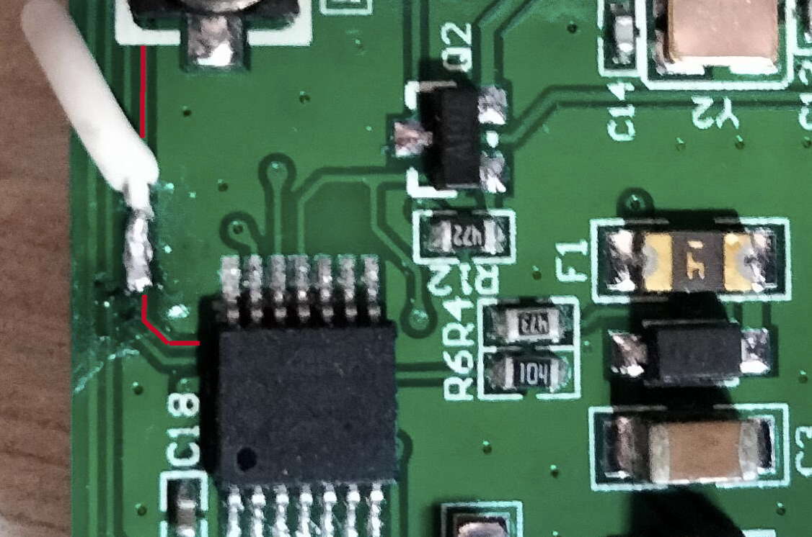

# Deelife USB TPMS MU9F/MU7J hack

This is a Python3 sample script to play with the USB TPMS module. it includes commands to pair, exchange and get the ID of TPMS devices.
The script reads the devices ID and get the pressure/temperature continously.
It could be useful if you plan to use this module on another platform than Android.

## Connect to an Ardruino

For my project I wanted to connect the serial line to the RX input of the ATmega328p. This is the track on the USB module you want to connect to : (don't forget to supply 5V to the module, though)

